# Nation Sound

## Description
Mon projet symfony permet à l'administrateur de voir, de modifier, d'ajouter, de supprimer les données qui sont affichées sur le front-end ReactJS, grâce à un dashboard qui comprend tous les CrudController.

## Exigences
- PHP 8 ou supérieur
- Symfony 7
- Composer

## Installation
1. Clonez ce dépôt sur votre machine locale :
   ```shell
   git clone https://github.com/wendy1976/nation_sound_symfony_backend2
2.Accédez au répertoire du projet :
  cd nation_sound_symfony_backend2
3. Installez les dépendances PHP en utilisant Composer :
  composer install
4.Configurez votre base de données dans le fichier .env et exécutez les migrations :
  php bin/console doctrine:migrations:migrate
5. Lancez le serveur de développement Symfony :
  symfony server:start
6.Accédez à l'application dans votre navigateur à l'adresse http://localhost:8000

## Structure et fonctionnalités générales
1.A partir de la page d'accueil:

  - lien vers le service d'administration (http://localhost:8000/admin)
  
2.En cliquant sur le lien, redirection vers le formulaire de connexion:
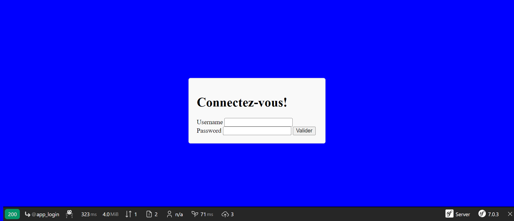

3.Service administration, avec un tableau de bord:


Ce tableau de bord, comprend les listes des données suivantes, que l'administrateur peut donc modifier, supprimer ou ajouter, ces modifications seront automatiquement modifiées sur le front-end:

  - la liste des scènes où nous pouvons en supprimer, en ajouter ou les éditer pour les modifier (avec leurs champs:nom)
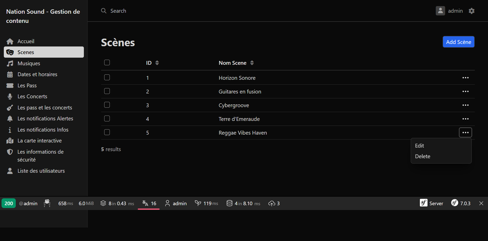
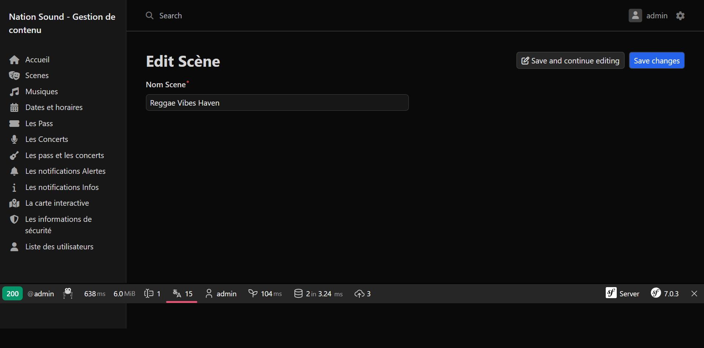

  - la liste des styles de musique: avec possibilité de les éditer et modifier, en rajouter, en supprimer
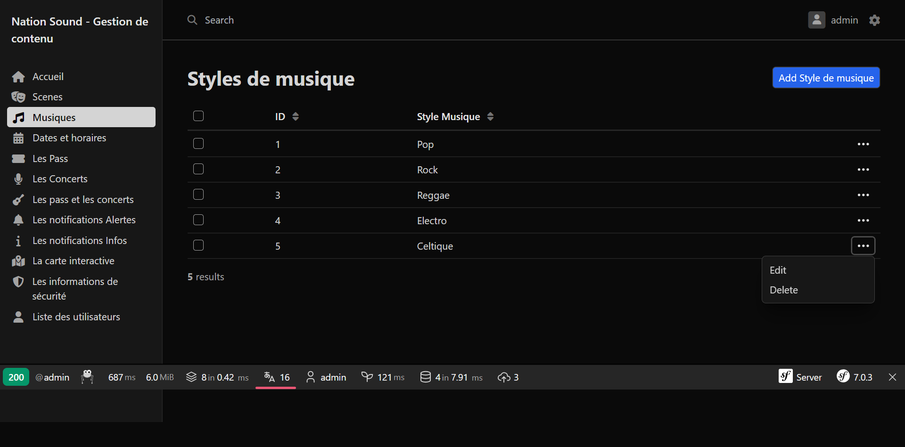


  - la liste des dates et horaires des concerts:avec possibilité de les éditer et modifier, en rajouter, en supprimer
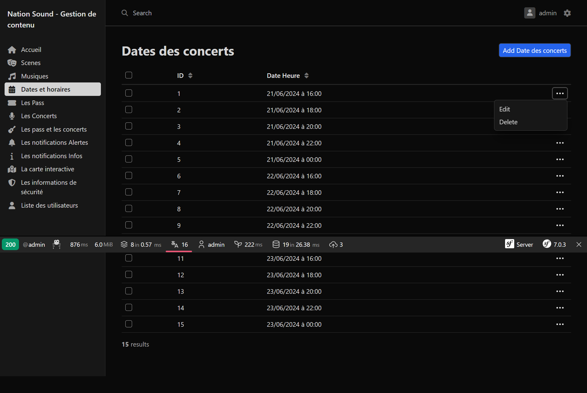


  - la liste des pass:avec possibilité de les éditer et modifier, en rajouter, en supprimer, (avec leurs champs: nom, description, prix et image)
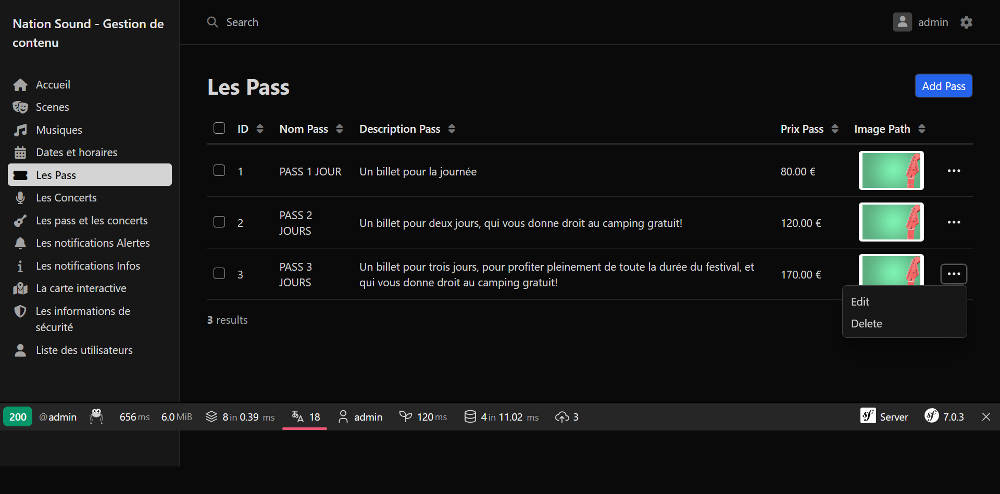


  - la liste des concerts:avec possibilité de les éditer et modifier, en rajouter, en supprimer, (avec leurs champs: nom de l'artiste, image, désignation,description, musique, scène et date de concert)


  - la liste des concerts et des pass: avec possibilité de les éditer et modifier, en rajouter, en supprimer, (avec leurs champs: nom du concert, nom du pass)


  - la liste des push notifications d'alertes: avec possibilité de les éditer et modifier, en rajouter, en supprimer, (avec leurs champs: titre, description et un lien externe)
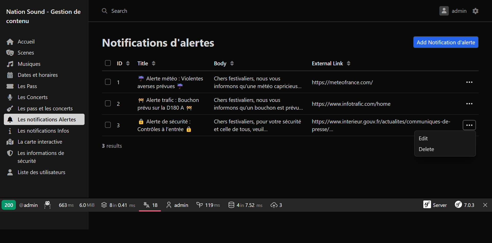


   - la liste des push notifications d'informations: avec possibilité de les éditer et modifier, en rajouter, en supprimer, (avec leurs champs: titre, description et un lien interne)
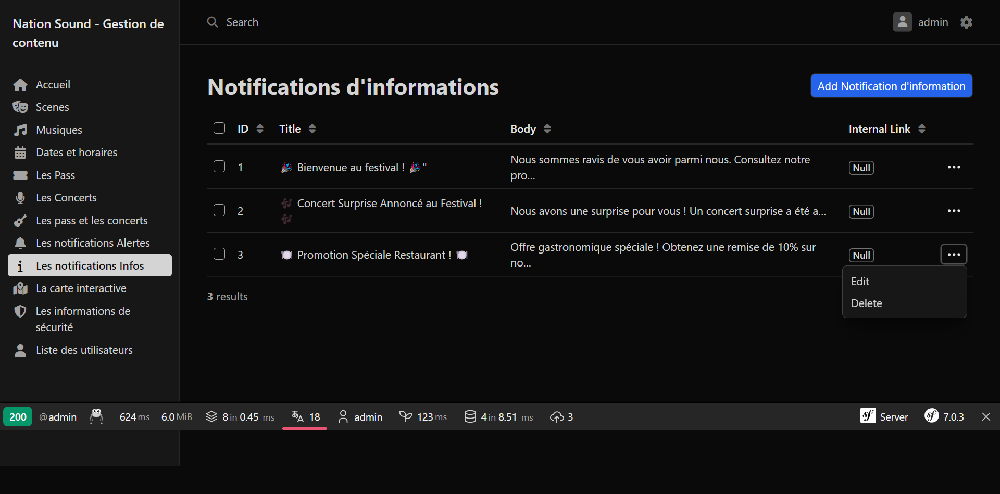
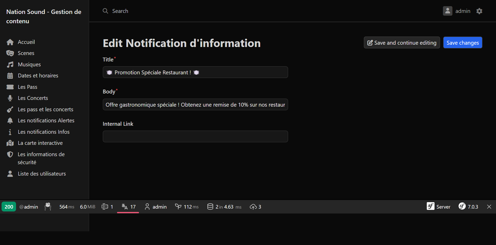

   - la liste des données de la carte interactive: avec possibilité de les éditer et modifier, en rajouter, en supprimer, (avec leurs champs: catégorie, coordonnées de localisation, icone, nom, contenu du pop-up et image)


   - la liste des informations de sécurité: avec possibilité de les éditer et modifier, en rajouter, en supprimer, (avec leurs champs: titre et contenu)
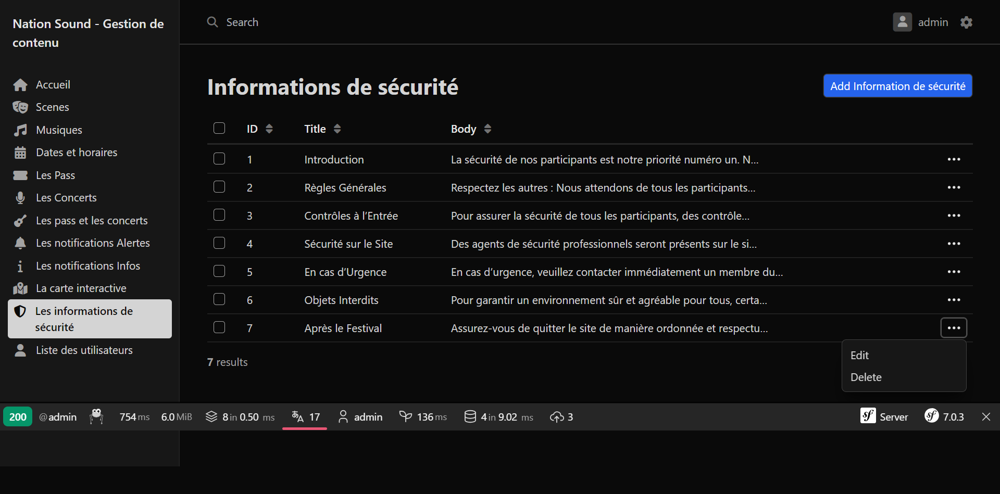
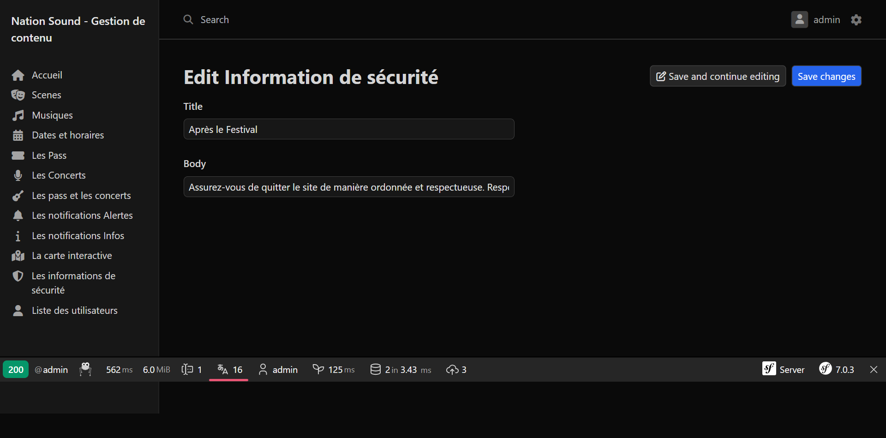

   - la liste des utilisateurs du front-end: avec possibilité de les éditer et modifier, en rajouter, en supprimer, (avec leurs champs: nom, prénom, email, mot de passe et email confirmation)
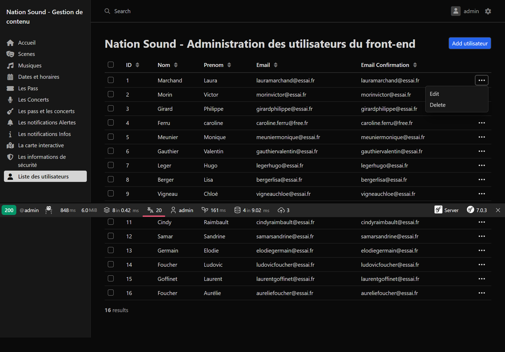


## Autres fonctionnalités:

 
- les mots de passe des utilisateurs et de l'administrateur sont chiffrés: voir le fichier config/packages/security.yaml, hachage des mots de passe:Symfony sélectionnera automatiquement le meilleur hachage disponible (bcrypt ou argon2i)
 


